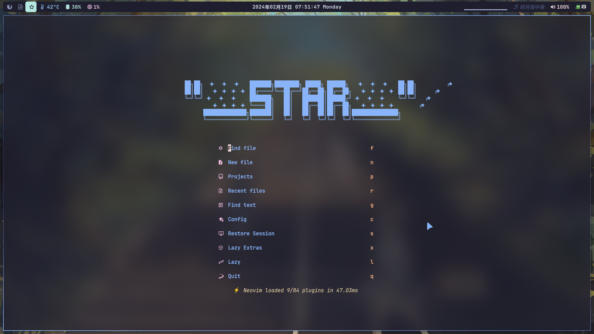
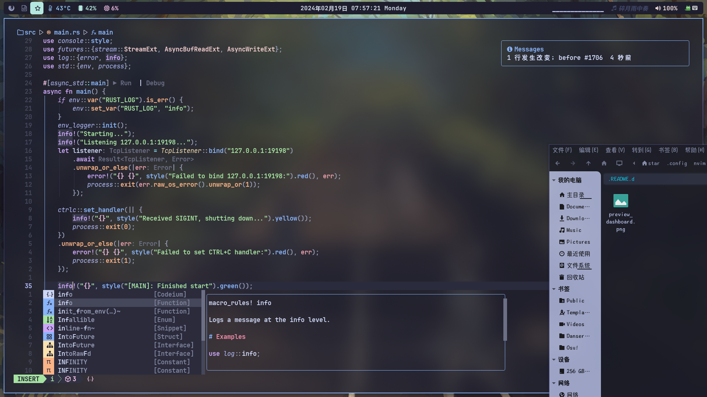

<h1 align="center">YammyNvim</h1>

A neovim dotfiles use [LazyVim](https://github.com/LazyVim/LazyVim).

## 🌟 Preview




## ⚡ Requirements

- [Neovim](https://github.com/neovim/neovim) >= **0.9.0** (needs to be built with **LuaJIT**)
- [Git](https://github.com/git/git) >= **2.19.0** (for partial clones support)
- a [Nerd Font](https://www.nerdfonts.com)(v3.0 or greater) **_(optional, but needed to display some icons)_**
- a [Node.js](https://nodejs.org/en) (for Mason)
- [lazygit](https://github.com/jesseduffield/lazygit) **_(optional)_**
- a **C** compiler for `nvim-treesitter`. See [here](https://github.com/nvim-treesitter/nvim-treesitter#requirements)
- for [telescope.nvim](https://github.com/nvim-telescope/telescope.nvim) **_(optional)_**
  - **live grep**: [ripgrep](https://github.com/BurntSushi/ripgrep)
  - **find files**: [fd](https://github.com/sharkdp/fd)
- a terminal that support true color and _undercurl_:
  - [kitty](https://github.com/kovidgoyal/kitty) **_(Linux & Macos)_**
  - [wezterm](https://github.com/wez/wezterm) **_(Linux, Macos & Windows)_**
  - [alacritty](https://github.com/alacritty/alacritty) **_(Linux, Macos & Windows)_**
  - [iterm2](https://iterm2.com/) **_(Macos)_**

## 🛠️ Install (Linux)

- Make a backup of your current Neovim files **_(If you have them)_**:

```bash
mv ~/.config/nvim{,.bak}
mv ~/.local/share/nvim{,.bak}
mv ~/.local/state/nvim{,.bak}
mv ~/.cache/nvim{,.bak}
# Or remove them:
rm -rf ~/.{config,local/share,local/state,cache}/nvim
```

- Clone the repo:

```bash
git clone https://github.com/SR-MyStar/YammyNvim ~/.config/nvim
```

- Start Neovim!

```bash
nvim
```
